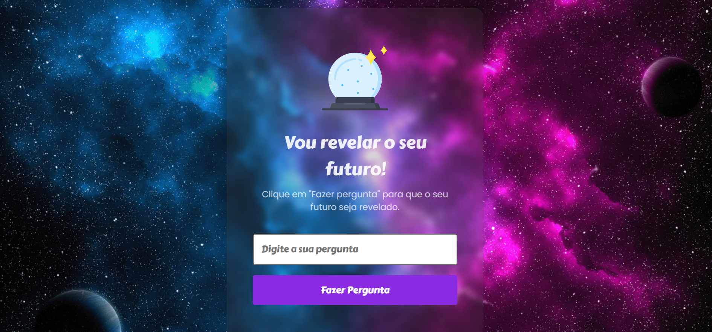

<h1 align="center"> Guessing The Future </h1>

<p align="center">
  <a href="#-the-project">The Project</a>&nbsp;&nbsp;&nbsp;|&nbsp;&nbsp;&nbsp;
  <a href="#-tecnologies">Tecnologies</a>&nbsp;&nbsp;&nbsp;|&nbsp;&nbsp;&nbsp;
  <a href="#-setup">Setup</a>&nbsp;&nbsp;&nbsp;|&nbsp;&nbsp;&nbsp;
  <a href="#memo-license">License</a>
</p>

<p align="center">
  
</p>

<br>

<p align="center">
  
</p>

## 💻 The Project

'Guessing the Future' is a fun project where the user can ask any question to the magician. 
The magician will answer to the question trying to guess the future.
You can ask as many questions as you want.

See the project 👉🏻[here](https://ma-oliveiramarques.github.io/guessing-the-future/) and have fun!


## 🚀 Tecnologies

This project was developed with the following technologies:

- [HTML](https://developer.mozilla.org/en-US/docs/Web/HTML)
- [CSS](https://developer.mozilla.org/en-US/docs/Web/CSS)
- [JavaScript](https://developer.mozilla.org/en-US/docs/Web/JavaScript)


## ⚙️ Setup

### Run locally

Create and go to the directory where you want to place the repository

```bash
    cd directory
```

Clone the project

```bash
  git clone https://github.com/ma-oliveiramarques/guessing-the-future.git

```

Go to the project directory

```bash
  cd guessing-the-future
```

Open in Visual Studio Code

```bash
  code .
```

## :memo: License

MIT

